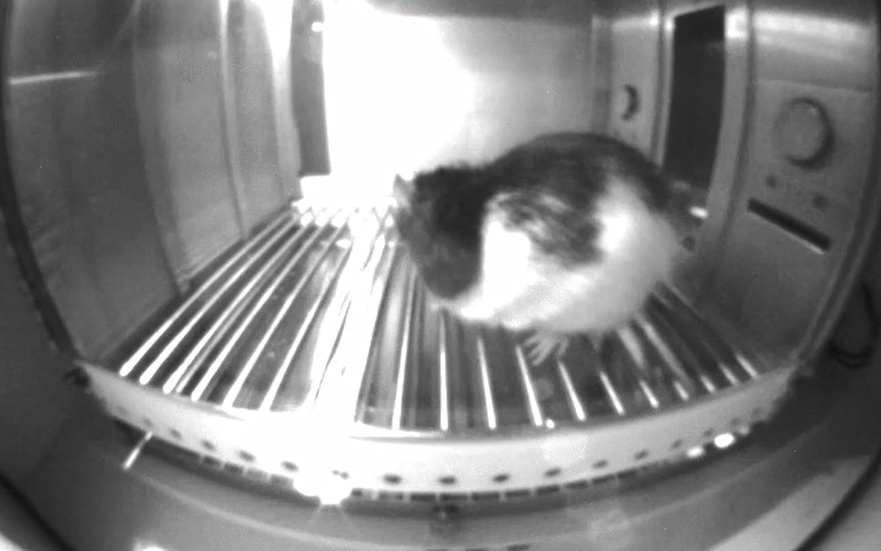

# Scoring Rats Behavior Using Neural Networks
## Introduction
  Scoring behavior of rodents is part of many Behavioral Neuroscience Reasearch Labs around the world. 
  These labs are using rodents in order to understand different behaviors, and research the brain sections and pathways related to such behaviors.
  Behavrios variey from simple movement, all the way to understanding fear, decision making, instincts and many more.
  The act of **scoring means taking a video of an animal, and analyzing its behavior throughout the video**, in periods of interest.
  Today, this is done by researchers in variuos labs, some has programs to make the process more efficent, but in general it is **a lengthy process
    which differs based on the human doing the scoring**, thus, there are differences in scores, especially across labs.
    

## Project Challenges and Benefits
  This project will focus on **automating scoring by training neural networks (NN)** to do this task for Long Evans rats **regarding 4 behaviors - 
  freezing, port/reward seeking, exploring and dirting**.
  There are few main challenges:
  1. There are **different strains** of rats, which look slightly different, far pattern ad color wise, as well as size difference.
  2. It is **hard to distinguish**, even to the human eye, between different behaviors. 
    Examples can be - not moving can be counted as freezing, wondering and looking around can look like reward seeking.
  3. There will be a need to develop **accurate and reliable datasets**, where theese term are not set in stone within the scientific community.
  4. Different lab use **different cameras abd camera settings**, therefore the videos and their quality differ tramandously
      (although this can part of the NN requirment).
  5. Dirting is a unique behvaior, which will probably need different mesurements than the other 3 behavrios.

  The **trained NN will analyze a new video** it never saw before and testing it performance. 
  If this goes well, future advancements can include more strains of rats, and later expand it to more behavrios and types of rodents.

  The **benefits** to rodent using labs and the whole scientific community are big, where the main ones are:
  - Save tremendous amount of human time
  - create a standartization of behavioral scoring
  - Save lab from doing this very annoying task!
  
  
 
## Project Goals
  1. Create a relevant dataset for training a NN for scoring (based on existing data)
  2. Develop an application/simple GUI to deploy the NN
  3. Enable the app to ignore irrelavnt parts of the video based on additional file
  4. Train a NN that is able to relaible score a video of Long Evans rat
  5. Obtain more types of videos and data to create a more reliable NN

